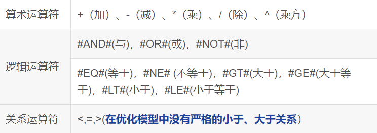
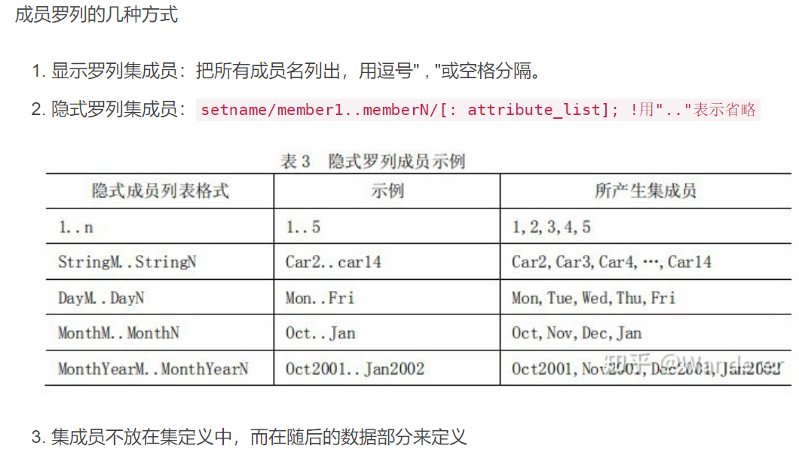

# Lingo基本语法

##### 参考网址

[B站教程](https://www.bilibili.com/video/BV17T4y1K7sL/?spm_id_from=333.337.search-card.all.click&vd_source=39ea2de87b63308a12bbabad318ba0fe)、[CSDN教程](https://blog.csdn.net/weixin_44068654?type=blog)

---

##### 简介	

​	Lingo是==L==inear ==I==nteractive a==n==d ==G==eneral ==O==ptimizer的缩写，即“交互式的线性和通用优化求解器”，可以用于求解非线性规划，也可以用于一些线性和非线性方程组的求解等，功能十分强大，是求解==优化模型==的最佳选择。
​	其特色在于内置建模语言，提供十几个内部函数，可以允许决策变量是整数（即整数规划，包括 0-1 整数规划），方便灵活，而且执行速度非常快。
​	Lingo有以下特点：
1. LINGO 的数学规划模型包含目标函数、决策变量、约束条件三个要素；

2. LINGO 程序中，每一个语句都必须要用一个英文状态下的分号结束，一个语句可以分几行输入；

3. LINGO 的注释以英文状态的！开始，必须以英文状态下的分号结束；

4. LINGO 的变量不区分字母的大小写，必须以字母开头，可以包含数字和下划线，不超过32 个字符；

5. LINGO 程序中，只要定义好集合后，其他语句的顺序是任意的；

6. LINGO 中的函数以“@”开头；

7. LINGO 程序默认所有的变量都是非负的；

8. LINGO 程序中"<“或”>"号与 ""或 " " 号功能相同。

---
##### 文件格式

1. 后缀“lg4”表示lingo格式的模型文件，只有lingo软件才可打开；
2. 后缀“lng”表示文本格式的模型文件；
3. 后缀“ldt”表示lingo数据文件；
4. 后缀“ltf”表示lingo命令脚本文件；
5. 后缀“lgr”表示lingo报告文件。

---

##### 运算符



---

##### 集合

集合与属性是Lingo中的重要概念，其中集又分为原始集和派生集。可以使用以下代码格式来定义一个原始集：

```Lingo
SETS：
　　原始集名/1....n（或1,2,3,...）/:属性1，属性2；
　　派生集名(原始集名1，原始集名2...)：属性1，属性2；
ENDSETS
```

与数组进行类比：1...n相当于数组的下标，属性相当于数组名，属性里的元素用属性名字来访问。原始集一般可类比为一维数组，派生集可以当做多维数组来使用。除此以外还有稠密集和稀疏集的概念，不做赘述。



实例  ('!'符号为注释符)：

~~~Lingo
SETS:
    FACTORIES /1..3/: Production, Cost;  ! 定义工厂集合及其属性：生产量和成本
ENDSETS

DATA:
    Production = 100, 150, 200  ! 初始化每个工厂的生产量
    Cost = 20, 25, 30  ! 初始化每个工厂的生产成本
ENDDATA:

MODEL:
    TOTAL_PRODUCTION = @SUM(FACTORIES: Production);
    TOTAL_COST = @SUM(FACTORIES: Cost);
ENDMODEL

PRINT TOTAL_PRODUCTION, TOTAL_COST;
~~~

输出结果：

~~~
TOTAL_PRODUCTION: 450（所有工厂的生产量总和：100 + 150 + 200）
TOTAL_COST: 75（所有工厂的成本总和：20 + 25 + 30）
~~~

---

##### 函数

- 内部函数

以'@'符号打头，常见函数有：

1. 数学函数  (进行数学运算)
   - @abs(x) 返回x 的绝对值
   - @sin(x) 返回x 的正弦值，x 采用弧度制
   - @cos(x) 返回x 的余弦值
   - @tan(x) 返回x 的正切值
   - @exp(x) 返回常数e 的x 次方
   - @log(x) 返回x 的自然对数
   - @lgm(x) 返回x 的gamma 函数的自然对数
   - @sign(x) 如果x<0 返回-1；否则，返回1
   - @floor(x) 返回x的整数部分。当x>=0 时，返回不超过x 的最大整数；当x<0时，返回不低于x 的最大整数。
   - @smax(x1,x2,…,xn) 返回x1，x2，…，xn 中的最大值
   - @smin(x1,x2,…,xn) 返回x1，x2，…，xn 中的最小值
2. 界定函数  (对变量划分定义域)
   - @bin(x) 限制x 为0 或1 ，用于0-1规划
   - @bnd(L,x,U) 限制L≤x≤U，也可以取消x非负的约束
   - @free(x) 取消对变量x 的默认下界为0 的限制，即x 可以取任意实数。(Lingo默认x为非负数)
   - @gin(x) 限制x 为整数在默认情况下，LINGO 规定变量是非负的，也就是说下界为0，上界为+∞。
3. 集循环函数  (???)
4. 辅助函数  (???)

- 外部函数  (???)

---

##### 段

用于组织和结构化模型，就好像写作文的起承转合4个段一个意思。Lingo常用有六个段：

1. SETS段

   用于定义集合及其属性。集合表示模型中的元素集，例如工厂、产品、时间段等。属性用于存储与集合元素相关的数据。

2. DATA段

   用于初始化集合的属性值。可以直接在该段中为属性赋值。

3. MODEL段

   用于定义模型中的方程、变量和目标函数。该段是模型的核心部分，描述了优化问题的数学结构。

4. INITIATE段

   用于在模型求解之前进行一些初始设置或计算。这个段通常包含模型的初始条件或预处理步骤。

5. REPORT段

   用于定义模型求解后的报告输出格式。可以指定要输出的结果和格式。

6. OBJECTIVE段

   用于定义优化问题的目标函数。可以是最大化或最小化某个表达式。

也可以分为5个段：

1. 集合段：与上相同。
2. 目标约束段：目标函数，约束条件等。
3. 数据段：对集合的属性输入必要的数据。
4. 初始段：与上相同，如求出一个好的迭代初始值。
5. 计算段：对原始数据进行计算处理。

---

==施工中！==
