# 学习latex

​	学习了latex的语法，基本流程如下：[速成教程](https://www.overleaf.com/learn/latex/Learn_LaTeX_in_30_minutes) -> [尝试实践](https://www.tablesgenerator.com/) -> [深度理解](https://lib.ustc.edu.cn/wp-content/uploads/2023/10/Latexlecture2023-1.pdf)。

​	主要语法直接用注释解释，长的会在下方文字解释。

### 基本用法

---

使用中文

```latex
\usepackage{xeCJK} % 导入中文库，之后设置编译器为xeCJK（或xelatex）
```

---

##### 文档类型

```latex
\documentclass{article} % 声明接下来文档类型是什么，控制文档整体外观。
\begin{document} % 正文开始
First document. This is a simple example, with no 
extra parameters or packages included.
\end{document} % 正文结束
```

[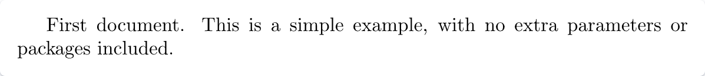](https://www.bilibili.com/video/BV1Eo4y177zz/?spm_id_from=333.337.top_right_bar_window_custom_collection.content.click "上方代码的效果")

[LaTeX中的documentclass命令：指定文档的类型和整体布局](https://blog.csdn.net/PolarisRisingWar/article/details/136135434 "肖宇是臭的")

---

##### 序言

```latex
\documentclass[12pt, letterpaper]{article} % 设置字体大小和纸张尺寸
\title{My first LaTeX document} % 文档标题
\author{Hubert Farnsworth\thanks{Funded by the Overleaf team.}} % 作者及感谢
\date{August 2022} % 日期
\begin{document} % 正文开始
\maketitle % 按上面设置的信息生成并排版序言。如果去掉了这行，整页就只剩下下面这一行话了。
We have now added a title, author and date to our first \LaTeX{} document!
\end{document} % 正文结束
```

[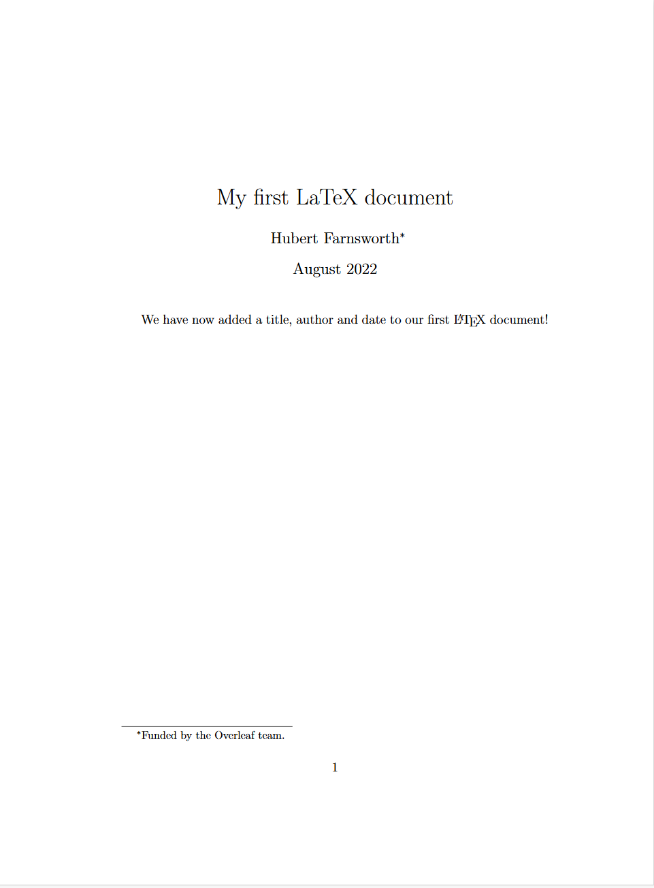](https://www.bilibili.com/video/BV113411s76X/?spm_id_from=333.788.top_right_bar_window_custom_collection.content.click&vd_source=39ea2de87b63308a12bbabad318ba0fe "上方代码的效果")

---

##### 粗体、斜体、下划线

```latex
Some of the \textbf{greatest} % textbf为粗体
discoveries in \underline{science} % underline为下划线
were made by \textbf{\textit{accident}}. % textit为斜体
```

[](https://www.bilibili.com/video/BV1YZ421e7BB/?spm_id_from=333.788.recommend_more_video.10&vd_source=39ea2de87b63308a12bbabad318ba0fe "上方代码的效果")

---

##### 图片

```latex
\documentclass{article} % 声明文档类型
\usepackage{graphicx} % 引入图像包以支持导入图像
\graphicspath{{images/}} % 图像文件夹路径，看你放哪了
 
\begin{document} % 正文开始
The universe is immense and it seems to be homogeneous, 
on a large scale, everywhere we look.

\includegraphics{universe} % 展示一次图像文件夹内叫universe的图片（可不含后缀）
 
There's a picture of a galaxy above.
\end{document} % 正文结束
```

[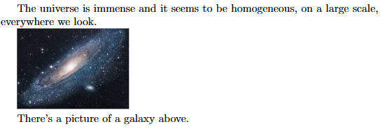](https://www.bilibili.com/video/BV1me411n7eu/?spm_id_from=333.788.top_right_bar_window_custom_collection.content.click&vd_source=39ea2de87b63308a12bbabad318ba0fe "上方代码的效果，请确保有这个图片")

```latex
\documentclass{article} % 声明文档类型
\usepackage{graphicx} % 引入图像包以支持导入图像
\graphicspath{{images/}} %图像文件夹路径，看你放哪了
 
\begin{document} % 正文开始

\begin{figure}[h] % 图像开始，h指here
    \centering % 图像置于中心
    \includegraphics[width=0.75\textwidth]{mesh} % 图像宽度为文本宽度的75%
    \caption{A nice plot.} % 设置图像标题，可放置在图像上方或下方
    \label{fig:mesh1} % 设置图像标签
\end{figure} % 图像结束
 
As you can see in figure \ref{fig:mesh1}, the function grows near the origin. This example is on page \pageref{fig:mesh1}. % ref指令表示mesh1标签的图像对应的数字，pageref指令表示mesh1标签对应的图像对应的页码

\end{document} % 正文结束
```

[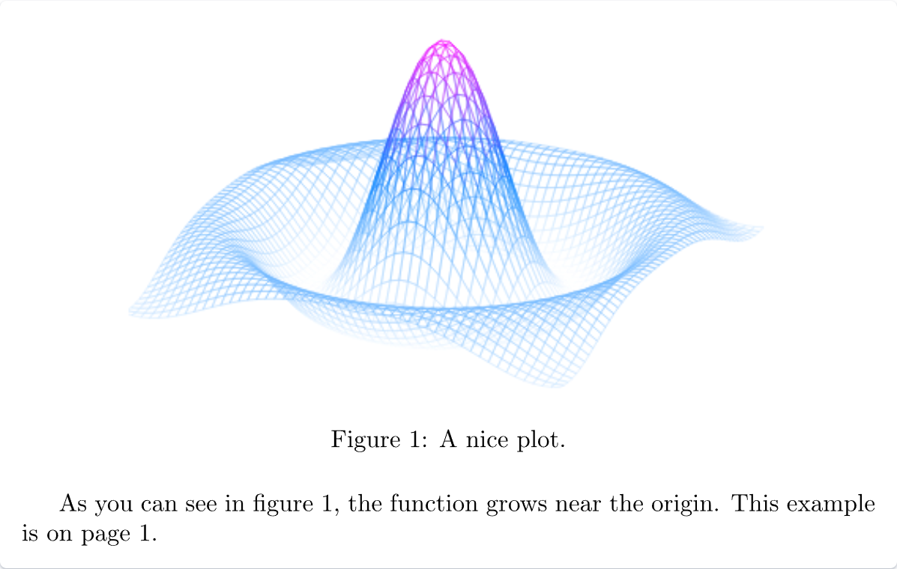](https://www.bilibili.com/video/BV1EF411X7PF/?spm_id_from=333.337.search-card.all.click&vd_source=39ea2de87b63308a12bbabad318ba0fe "上方代码的效果")

---

##### 列表

```latex
\documentclass{article} % 声明文档类型
\begin{document} % 正文开始
\begin{itemize} % 无序列表开始
  \item The individual entries are indicated with a black dot, a so-called bullet. % 一个列表项
  \item The text in the entries may be of any length. % 一个列表项
\end{itemize} % 无序列表结束
\begin{enumerate} % 有序列表开始
  \item This is the first entry in our list.
  \item The list numbers increase with each entry we add.
\end{enumerate} % 有序列表结束
\end{document} % 正文结束
```

[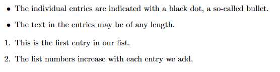](https://www.bilibili.com/video/BV1t14y1e7sC/?spm_id_from=333.788.recommend_more_video.0&vd_source=39ea2de87b63308a12bbabad318ba0fe "上方代码的效果")

[更多列表形式](https://www.overleaf.com/project/668a24bb50a702f0b0d3a2b4 "肖宇是臭的")

---

##### 数学表达式

```latex
\documentclass[12pt, letterpaper]{article} % 声明接下来文档类型是什么，控制文档整体外观。
\begin{document} % 正文开始
The mass-energy equivalence is described by the famous equation
\[ E=mc^2 \] discovered in 1905 by Albert Einstein. % 内联无编号公式，并独占一行

In natural units ($c = 1$), the formula expresses the identity % 内联无编号公式
\begin{equation} % 开始内联有编号公式
E=m
\end{equation} % 有编号公式结束
\end{document} % 正文结束
```

[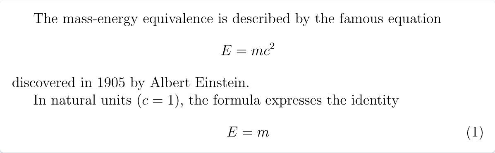](https://www.bilibili.com/video/BV1PS421P7W6/?spm_id_from=333.788.top_right_bar_window_custom_collection.content.click&vd_source=39ea2de87b63308a12bbabad318ba0fe "上方代码的效果")

更多示例：

- [More math content typeset in LaTeX (1)](https://www.overleaf.com/project/668a29d5de1502c65bb4d776)
- [More math content typeset in LaTeX (2)](https://www.overleaf.com/project/668a2a48707865d70acd6700)
- [Demonstrating inline math mode](https://www.overleaf.com/project/668a2a3b50a702f0b0d49804)
- [Demonstrating various types of LaTeX list (2)](https://www.overleaf.com/project/668a24bb50a702f0b0d3a2b4)
- [More advanced LaTeX math example (2)](https://www.overleaf.com/project/668a2a4150a702f0b0d498fe)
- [数学表达式](https://www.overleaf.com/learn/latex/Mathematical_expressions)
- [下标和上标](https://www.overleaf.com/learn/latex/Subscripts_and_superscripts)
- [括号和括号](https://www.overleaf.com/learn/latex/Brackets_and_Parentheses)
- [分数和二项式](https://www.overleaf.com/learn/latex/Fractions_and_Binomials)
- [对齐方程](https://www.overleaf.com/learn/latex/Aligning_equations_with_amsmath)
- [运营商](https://www.overleaf.com/learn/latex/Operators)
- [数学模式下的间距](https://www.overleaf.com/learn/latex/Spacing_in_math_mode)
- [积分、求和和极限](https://www.overleaf.com/learn/latex/Integrals%2C_sums_and_limits)
- [数学模式下的显示样式](https://www.overleaf.com/learn/latex/Display_style_in_math_mode)
- [希腊字母和数学符号列表](https://www.overleaf.com/learn/latex/List_of_Greek_letters_and_math_symbols)
- [数学字体](https://www.overleaf.com/learn/latex/Mathematical_fonts)

---

##### 摘要

```latex
\documentclass{article} % 声明文档类型
\begin{document} % 正文开始
\begin{abstract} % 摘要开始
This is a simple paragraph at the beginning of the 
document. A brief introduction about the main subject.
\end{abstract} % 摘要结束
\end{document} % 正文结束
```

[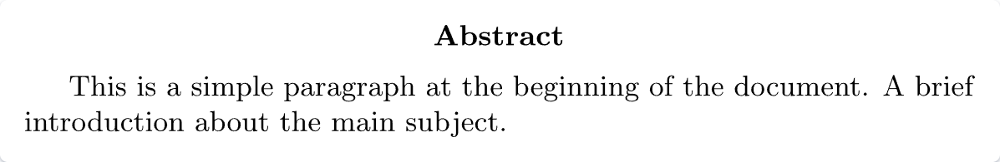](https://www.bilibili.com/video/BV1RM411d7kN/?spm_id_from=333.788.top_right_bar_window_custom_collection.content.click "上方代码的效果")

---

##### 段落和换行

```latex
\documentclass{article} % 声明文档类型
\begin{document} % 正文开始

\begin{abstract} % 摘要开始
This is a simple paragraph at the beginning of the 
document. A brief introduction about the main subject.
\end{abstract} % 摘要结束

After our abstract we can begin the first paragraph, then press ``enter'' twice to start the second one.

This line will start a second paragraph.

I will start the third paragraph and then add \\ a manual line break which causes this text to start on a new line but remains part of the same paragraph. Alternatively, I can use the \verb|\newline|\newline command to start a new line, which is also part of the same paragraph.
\end{document} % 正文结束
```

[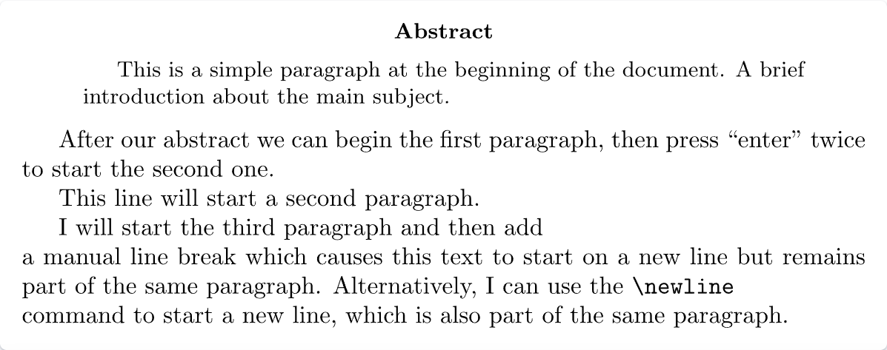](https://www.bilibili.com/video/BV1Hz421m7AH/?spm_id_from=333.788.top_right_bar_window_custom_collection.content.click "上方代码的效果")

总的来讲，就是连续使用两次"Enter"进行，也可以使用以下指令进行换行（但不会缩进）。

```latex
\par
\\
\newline
\hfill \break
```

可以使用以下指令进行换页：

```latex
\newpage
```

可以使用以下指令改变内容的位置：

~~~latex
\documentclass[]{article} % 声明文档内容
\begin{document} % 正文开始
\begin{center} % 开始在中间写
    center center
\end{center} % 结束
\begin{flushleft} % 开始在左边写
    left left left
\end{flushleft} % 结束
\begin{flushright} % 开始在右边写
    right right right
\end{flushright} % 结束
\end{document} % 正文结束
~~~

[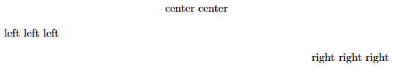](https://www.bilibili.com/video/BV1UK411n7F6/?spm_id_from=333.1007.top_right_bar_window_custom_collection.content.click "上方代码的效果")

更多信息请看以下链接：

- [段落和换行](https://www.overleaf.com/learn/latex/Paragraphs_and_new_lines)
- [如何在LaTeX中更改段落间距](https://www.overleaf.com/learn/latex/Articles/How_to_change_paragraph_spacing_in_LaTeX)
- [LaTeX 错误：这里没有一行结束，](https://www.overleaf.com/learn/latex/Errors/LaTeX_Error%3A_There's_no_line_here_to_end)提供了有关使用 .`\\`

---

##### 章节

*总的来说*，LaTeX 文档类提供以下分段命令(大括号里自己改)，每个特定类都支持一个相关的子集：

- `\part{part}`
- `\chapter{chapter}`
- `\section{section}`
- `\subsection{subsection}`
- `\subsubsection{subsubsection}`
- `\paragraph{paragraph}`
- `\subparagraph{subparagraph}`

[可查看这个例子](https://www.overleaf.com/project/668a321666dcc710b7275f66)

---

##### 表格

```latex
\documentclass{article} % 声明文档类型
\begin{document} % 正文开始
\begin{center} % 开始在中间写
\begin{tabular}{|c|c|c|} % 开始写表格，表格格式为一行三个列表项，中间靠竖线分隔
 \hline % 一根横线
 cell1 & cell2 & cell3 \\ % 3个列表项，换行
 cell4 & cell5 & cell6 \\ 
 cell7 & cell8 & cell9 \\ 
 \hline % 一根横线
\end{tabular} % 表格结束
\end{center} % 结束
\end{document} % 正文结束
```

[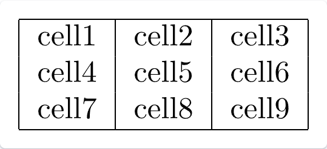](https://www.bilibili.com/video/BV1vE411v7k3/?spm_id_from=333.788.recommend_more_video.3&vd_source=39ea2de87b63308a12bbabad318ba0fe "上方代码的效果")

~~~latex
\documentclass{article} % 声明文档类型
\begin{document} % 正文开始
Table \ref{table:data} shows how to add a table caption and reference a table.
\begin{table}[h!] % 开始写表格，h！指在必须这里
\centering % 表格置于中心
\begin{tabular}{||c c c c||} % 开始写表格，表格样式为一行四个列表项，表格左右两侧两根竖线
 \hline % 一条横线
 Col1 & Col2 & Col2 & Col3 \\ [0.5ex] % 四个列表项，最后那个是行距(仅在最后生效)
 \hline\hline % 两根横线，则表格左右两侧会断开
 1 & 6 & 87837 & 787 \\ 
 2 & 7 & 78 & 5415 \\
 3 & 545 & 778 & 7507 \\
 4 & 545 & 18744 & 7560 \\
 5 & 88 & 788 & 6344 \\ [1ex] % 最后那个是行距(仅在最后生效)
 \hline % 一根横线
\end{tabular} % 表格结束
\caption{Table to test captions and labels.} % 设置表格标题
\label{table:data} % 设置表格标签
\end{table} % 表格结束
\end{document} % 正文结束
% 注意，table和tabular是不同的，table还包括标题和标签等信息
~~~

[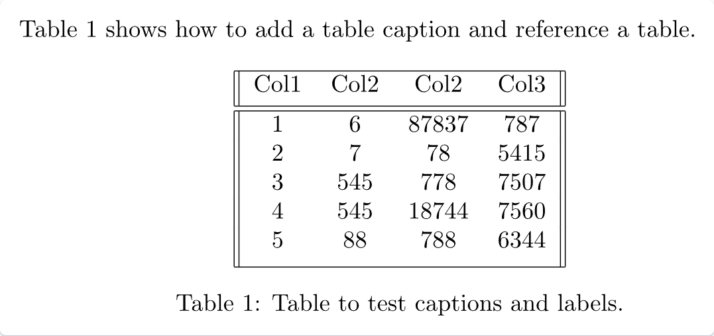](https://www.bilibili.com/video/BV1Mx4y137fa/?spm_id_from=333.788.recommend_more_video.2&vd_source=39ea2de87b63308a12bbabad318ba0fe "上方代码的效果")

[更多latex表格技巧](https://blog.csdn.net/weixin_55083102/article/details/127453545)

---

##### 目录

[有点长，对着这个自己看吧](https://www.overleaf.com/project/668abb5e4432d0e564d47cb7)
