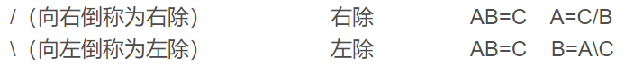

# Matlab基本语法

教学网站：最经典的[菜鸟教程](https://www.cainiaojc.com/matlab/matlab-tutorial.html)。

由于大部分语法十分简单，这里只介绍部分有特色的语法。

---

#### 零散语法

- 在一个句子结束时，你可以选择加上分号(;)也可以选择不加。如果不加分号，这个语句产生的结果会打印出来，反之则不打印。

- 百分号(%)用于表示注释。

- 求幂运算符是(^)。

- 除法分为左除(\\)和右除(/)。

- 特殊变量和常量。matlab支持以下特殊变量和常量。

  | 名称 |            意义            |
  | :--: | :------------------------: |
  | ans  |      最近计算的结果。      |
  | eps  |         浮点精度。         |
  | i,j  |         虚数单位。         |
  | Inf  |           无穷。           |
  | NaN  | 未定义的数值结果(非数字)。 |
  |  pi  |            π。             |

- 修改数字精度可使用format命令(具体见教程)。

- 数组元素之间可加逗号也可使用空格，分号表示换行。

- MATLAB提供了用于管理会话的各种命令。下表提供了所有此类命令。

|  命令   |            目的            |
| :-----: | :------------------------: |
|   clc   |       清除命令窗口。       |
|  clear  |     从内存中删除变量。     |
|  exist  |   检查文件或变量的存在。   |
| global  |    声明变量为全局变量。    |
|  help   |       搜索帮助主题。       |
| lookfor |  在帮助条目中搜索关键字。  |
|  quit   |        停止matlab。        |
|   who   |    列出所有当前变量名。    |
|  whos   | 列出所有当前变量详细信息。 |

- 变量不需要声明类型，会自动分配。但如果分配的不是你想要的或者你中途想改变类型，可以使用数据类型转换指令。

- 条件语句，循环语句格式需注意一下。

- 向量、矩阵的起始下标为1。

- 数组的操作十分简单，不需要自己写函数，[这](https://www.cainiaojc.com/matlab/matlab-arrays.html)有大量函数给你调用。

- 引用矩阵元素时，可用冒号(:)代替某维度元素。如：a(: , 2)代表矩阵a的第2列所有元素。

- 冒号(:)有多种用法，如创建向量，下标数组和指定迭代。下面讲解冒号表示法：

  ~~~matlab
  1:10 % 从1到10，步长默认为1，ans = 1 2 3 4 5 6 7 8 9 10
  100:-5:50 % 从100到50，步长为-5，ans = 100 95 90 85 80 75 70 65 60 55 50
  A(:,j) % 矩阵A的第j列
  A(i,:) % 矩阵A的第i行
  A(i:j) % 向量[ A(i) A(i+1) ... A(j) ]
  A(i1:i2,j1:j2) % 矩阵A的第i1到i2行的第j1到j2列
  ~~~

---

- #### 函数

在matlab中，函数是在单独的文件中定义的。文件名和函数名应该相同。

函数的语法是：function [out1,out2, ..., outN] = myfun(in1,in2,in3, ..., inN)。函数第一行以关键字function开头，再给出 输出参数 = 函数名(输入参数) ，在添加注释行提供帮助文本后即可开始书写函数内容。

匿名函数、主和子函数、嵌套函数、私有函数等内容在数模中较为少用，==略==。

---

#### 数据导入与导出

易，要用时自行查阅教程。