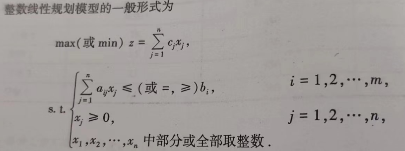
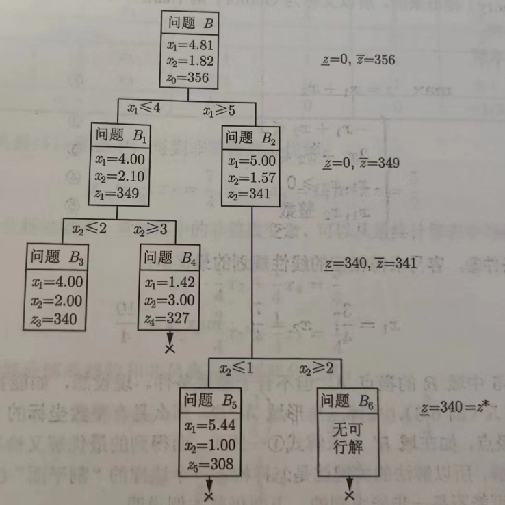

# 整数规划

​	一部分或者全部决策变量必须取整数值的规划问题被称为整数规划。从决策变量的取值范围来看，通常可以被分为三类：

 	1. 纯整数规划：全部决策变量都必须取整数值的整数规划模型。
 	2. 混合整数规划：决策变量中有一部分必须取整数值，另一部分可以不取整数值的整数规划模型。
 	3. 0-1整数规划：决策变量只能取0或1的整数规划。

---

##### 非线性约束条件的线性化

- 对于相互排斥的约束条件，可以通过引入0-1变量(相当于一个开关)建立一个通式，变为普通的约束条件。
- 当出现分段条件时，也可以通过引入0-1变量建立通式。

---

##### 蒙特卡洛法

​	基于大量事件的统计结果来实现一些确定性问题的计算(大数定律)。在某些整数规划问题中，如非线性整数规划，求解的难度很大，使用枚举法又非常费时。此时可以通过蒙特卡洛法求得一个近似的满意解，在节省数个数量级的计算量的同时有着很高的可信度。

---

##### 分支定界解法

​	将整数线性规划的问题华为一系列普通线性规划问题求解。

​	原理：设有最大化的整数规划问题A，它相应的线性规划问题为B(即除去整数约束)，那么B的最优解肯定是A的最优解的上界↑(只是少了些约束条件)，而A的可行解都是A的最优解的下界↓，那么逐步让↑和↓相互逼近就能找到问题A的最优解。

​	那么，如何让上下界相互逼近呢？

- 对于上界(常用)：逐步给B增加约束条件，如假设最优解中x~1~=4.2，则增加约束:x~1~≥5,x~1~≤4,即将B划分为两个子问题B~1~、B~2~，则上界必定会不动或者往下走。
- 对于下界：试多几个可行解，将值最大的作为下界就行。

​	注意，并非上下界贴近才能找到A的最优解，上界下移的过程中也可能找的到最优解。

​	总体步骤：

1. 先针对问题B，可能有以下情况之一：
   - 问题B没有可行解，则无解，停止。
   - 问题B有整数最优解，则找到了，停止。
   - 问题B有非整数最优解，则标记函数值为z~up~。
2. 随便找一个问题A的可行解，求得其目标函数值z~down~。记问题A的最优解为z^*^，则z~up~≥z^*^≥z~down~。
3. 进行迭代。
   - 在问题B的最优解里任选一个不符合整数条件的变量x~j~，其值为b~j~，构造两个约束条件 x~j~≤[b~j~]，x~j~≥[b~j~]+1，形成两个后继规划问题B~1~和B~2~。以每个后继问题为一分支表明求解的结果，与其他问题的解比较，找出最优目标函数值的最大者作为新的上界z~up~，将满足整数条件的解的目标函数最大值作为新的下界z~down~(若其大于原下界)。
   - 若各分支的最优目标函数值中有小于z~down~的，则剪掉这支。若大于z~down~且不符合整数条件，则继续进行迭代。

示意图：

---

##### 割平面解法

​	将整数线性规划的问题化为一系列普通线性规划问题求解。

​	原理：先不考虑整数约束，求解线性规划，若最优解为非整数，则增加割平面(线性约束)去掉可行域的一部分，该部分只包含非整数解。当多次分割后直到最优解是整数解。

​	这个方法比较好懂，但最难的点在于如何选择恰当的割平面，在此略写。
