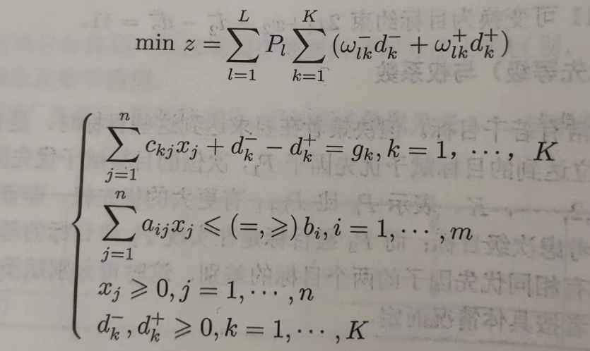

# 线性目标规划

​	目标规划的特点是存在多个目标，且约束条件是软约束的==目标约束==而不是硬约束的绝对约束。

---

##### 目标约束

​	目标约束是目标规划特有的，把约束右端项看作要追求的目标值，在达到此目标是允许发生一些误差，因此引入==正负偏差变量==d^+^,d^-^，恒有 d^+^ · d^-^ = 0 。通过偏差变量，可以将绝对约束软化为目标约束，还可以将目标函数转化为目标约束。

---

##### 优先因子和权系数

​	目标规划问题又若干个目标，但它们之间可能是存在主次或轻重缓急的不同的。==优先因子==P~k~就是目标优先度的一种量化，k越小则目标越优先，首先保证优先度高的目标而不需要考虑优先度低的目标(P~k~>>P~k+1~)。

​	对于具有相同优先因子的多个目标，可以赋予他们不同的==权系数==w~j~，按具体情况而定。

---

##### 目标函数

​	按照各目标约束的正负偏差变量和赋予的优先因子和权系数所构成。

---

##### 数学模型

