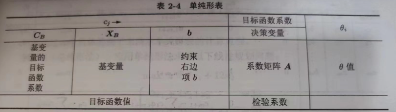

# 单纯形法

可参考资料：运筹学教材、[CSDN教程_1](https://blog.csdn.net/shulianghan/article/details/114498881)、[CSDN教程_2](https://blog.csdn.net/qq_36558948/article/details/80640768)。

---

##### 前言

单纯形法是解决[线性规划](线性规划.md)问题的一个有效的算法，本文仅简单介绍单纯形法。

可以证明：

1. 线性规划问题的可行域都是[^凸集]\(运筹学教材P28\)
2. 若可行域有界，则其最优值必在某个顶点处获得(运筹学教材P29)
3. 线性规划问题的[^基可行解]X刚好对应于可行域上的某个顶点(运筹学教材P29)。

---

##### 介绍

- 步骤：
  1. 确定初始基可行解
  2. 判断最优性，即目标函数中非基变量系数是否都为负。若是则结束
  3. 换基迭代，重复第二步
- 原理：

​	搜索可行域的相邻顶点直至最优。

---

##### 单纯形表

更直观地进行换基迭代计算过程，将搜索基可行解的过程通过表格方式描述(详见运筹学教材P38)。

---

脚注：

[^凸集]:对集合D中任意两点X~1~,X~2~，若对任意α∈(0,1)，均有αX~1~+(1-α)X~2~∈D，则集合D是一个凸集。
[^基可行解]:满足非负取值的基解，详见运筹学教材P26。