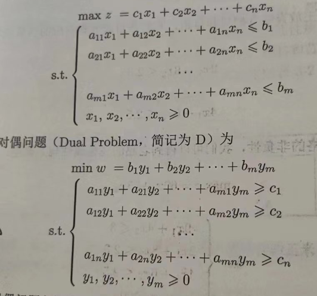
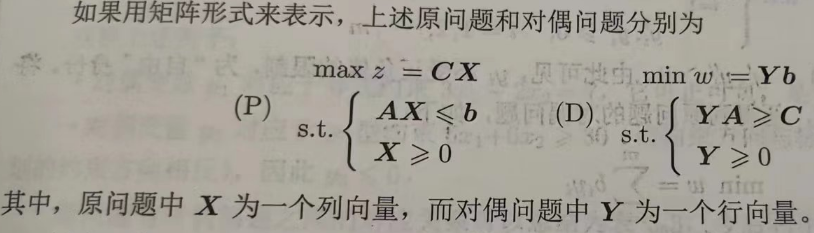
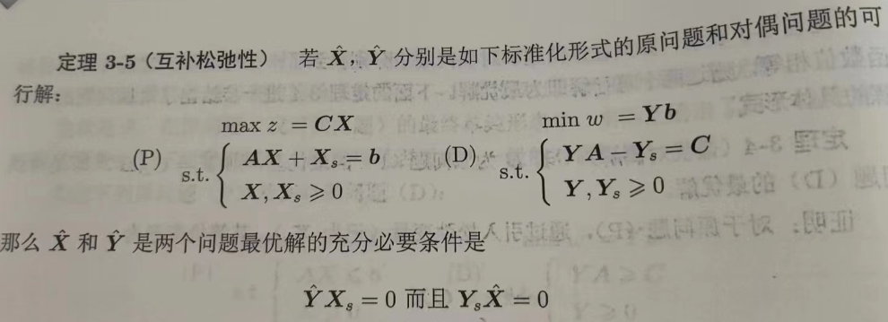

# 对偶理论与敏感性分析

​	假设两种事物A与B之间存在某种关系，从A观察B这种关系表示为A⊕B，那么往往从B观察A会有另一种关系表示为A⊗B，⊕与⊗是对称关系。在每个线性规划问题中，都有预支对应的另一个线性规划问题，被称为它的对偶问题，充分显示出线性规划理论的严谨性和结构的对称性。对偶问题的最优解和原始问题的最优解之间也存在某种对应关系，可以帮助我们进行敏感性分析[^1]。

---

##### 例子

​	假设工厂甲生产商品A、B，他们的的单位利润分别为80元和100元；每单位消耗劳动力为8和4，劳动力上限为360；每单位材料成本为4元和5元，成本有200元。

- 工厂甲角度，求总利润最大化：

​	设x~1~、x~2~分别为A、B的产量。

​	目标函数为：     max z = 80x~1~ + 100x~2~

​	约束条件为：     8x~1~ + 4x~2~ ≤ 360     &&     4x~1~ + 5x~2~ ≤ 200      &&       x~1~,x~2~ ≥ 0                                     （劳动力和材料成本不超上限）

​	可以算出，最优解时z = 4000 

​	假设此时，工厂乙想用工厂甲的劳动力和材料。工厂甲为了自身利润最大化，工厂乙必须给出一定的报酬，但它为了自身利润，只想付出最小代价。

- 工厂乙角度，求总成本最小化：

​	设y~1~、y~2~分别为劳动力和材料的单位报酬。

​	目标函数为：     min w = 360y~1~ + 200y~2~

​	约束条件为：     8y~1~ + 4 y~2~ ≥ 80      &&      4y~1~ + 5y~2~ ≥ 100      &&      y~1~,y~2~ ≥ 0                                       （报酬不低于A、B产品利润）

​	可以算出，最优解时w = 4000

​	可以发现w与z是相同的，乙付出的最小代价恰好等于甲的最大利润，我们称这两个模型互为对偶的线性规划模型。在我添加工厂乙这个概念时，你可以发现并没有加入什么其他条件，一切数据来源于初始题目。我们只是通过其它观测视角，找到了这个问题的第二种解决方案。

---

##### 对偶理论

对称关系体现于：

- 原问题的每个约束条件对应对偶问题的一个决策变量。
- 原问题求的和对偶问题求的是相反的最值。
- 原问题的目标函数系数都是对偶问题约束条件右边项。
- 原问题的约束右边项对应对偶问题的目标函数系数。
- 原问题的系数矩阵和对偶问题的系数矩阵互为转置关系。
- 原问题的约束条件方向与对偶问题约束条件方向相反。

仔细观察规律，易推出带有等式约束条件的线性规划问题，在这就不写了，若懒得推就看P69。

---

##### 对偶问题性质

- 对称性：对偶问题的对偶问题是原问题。
- 弱对偶性：若**X**是原问题的任一可行解，**Y**是对偶问题的任一可行解，那么**CX**≤**Yb** , 即max z ≤ min w    (表明上界或下界)。
- 最优性：若**CX**=**Yb**，即max z = min w，则它们是最优解。  （互相抵达上下界）
- 最优对偶性：若**B**为原问题的最优基，则**Y**=**C~B~B^-1^**即对偶问题的最优解。   （表明若均有可行解，则必有有界最优解）
- 互补松弛性：如下图。    （若X=Y≠0，则松弛变量和剩余变量为0；若松弛变量或剩余变量不为0，则X=Y=0）

---

##### 意义

1. 帮助我们优化线性规划问题。
2. 建立了原问题和对偶问题之间的关系，帮助我们从不同角度来理解和求解线性规划问题。
3. 对偶问题可以给出原始问题一个下界(或上界)。
4. 对偶问题的变量被称为影子价格，对应这原问题中的资源约束，可以提供更深度的含义解释。

---

##### 敏感性分析

​	在线性规划的求解中，假定所有参数都是常数，但实际应用中它们可能有所波动，可能会影响到最优决策解。敏感性分析就是在已求得最优解的情况下，对系数进行分析（变量与系数身份交换），探求他们在什么阀内内变化时不影响最优解，或最优解会有什么变化，若变化则如何快速得到最优解。

1. 约束右边项的敏感性分析（运筹学教材P85）

   约束右边项的变动，实质上就是决策变量的可行域(定义域)发生了变动，但目标函数和等值线方向是不变的，故最优解不一定发生变化。要保持最优基不变，只需满足所有的基变量的取值为非负即可。

   - 100%法则：若约束项右边参数变化的相对百分比之和不超过100%，则线性规划的最优基和阴影价格不变。（充分条件）

2. 目标函数系数的敏感性分析（运筹学教材P89）

   目标函数系数的变动，实质上就是等值线的方向发生了变动，但可行域是不变的，故最优解不一定发生变化。要保持最优基不变，只需满足各非基变量检验数均非负即可。

3. 系数矩阵系数的敏感性分析（运筹学教材P92）

   计算出有系数改变的新基，将对应的旧基替换再计算即可。

4. 添加新变量的敏感性分析（运筹学教材P93）

   若添加的新变量的检验系数小于0时，那么它只会使目标函数的值降低，故不影响最优解。若检验系数大于0，对其进行换基迭代再计算即可。

5. 添加新约束的敏感性分析（运筹学教材P95）

   要判断是否影响最优解，只需判断原最优决策是否超过该约束。若超过，则多引入一个基变量，进行换基迭代再计算即可。

- 敏感性分析研究数学模型或系统输出的不确定性如何分配到输入的不确定性的不同来源。每个输入的灵敏度通常由一个数值表示，称为灵敏度指数。

  敏感性指数有几种形式：

  - 一阶指标：仅通过单个输入来测量对输出方差的贡献。
  - 二阶指标：测量两个输入相互作用对输出方差的贡献。
  - 总阶指数：测量模型输入对输出方差的贡献，包括它的一阶效应（输入单独变化）和所有高阶交互作用。

- 常用敏感性分析方法：
  - 局部敏感性分析：最简单且常见的方法之一是一次只改变一个因素，以查看对输出的影响。这有助于确定哪个输入因素导致了模型故障，但无法检测多个输入之间的耦合。
  - 基于局部导数的方法：使用偏导数来测量输出对单个输入变量的灵敏度。
  - 回归分析：通过线性回归计算标准化回归系数作为灵敏度的直接度量。
  - 基于方差的方法：将输出方差分解为可归属于输入变量和变量组合的部分，允许探索输入空间中的交互作用和非线性响应。
  - 筛选方法：用于确定哪些输入变量对高维模型的输出不确定性有重要影响，而不是精确量化敏感性。
  - 傅里叶振幅敏感性测试（FAST）：使用傅里叶级数表示频域内的多元函数，从而节省计算时间。

---

[^1]:又称灵敏度分析。
