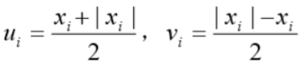
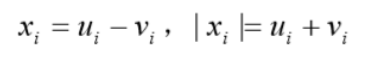

# 线性规划

参考资料：[CSDN—1](https://blog.csdn.net/qq_29831163/article/details/88893234)、[CSDN—2](https://blog.csdn.net/qq_29831163/article/details/88894966)、[CSDN—3](https://blog.csdn.net/qq_29831163/article/details/88896399)、[CSDN—4](https://blog.csdn.net/qq_29831163/article/details/89502094)、数学建模教材、运筹学教材。

---

##### 基本概念

​	线性规划就是在一组线性约束条件下，求解目标函数最优解的问题。

​	如何把实际问题转换为数学问题呢？关键就在于从实际问题中找到[^目标函数]以及对应的[^决策变量]和问题中给出或隐含的[^约束条件]，隐藏约束条件的寻找往往需要细心以及一定的经验。

​	找到上诉三个核心后，便可建立规划模型。若满足[^比例性]、[^可加性]、[^连续性]、[^确定性]，则可以建立线性规划模型。虽然线性规划模型有多种不同的形式，但为了方便分析线性规划问题的性质，我们可以通过等价变化将任何类型的线性规划模型转化为标准型。线性规划模型的标准型如下：

- 如何将求最小值的目标函数转为求最大值

​	乘个-1就行。

- 如何将约束条件的不等式转为等式

  可通过添加[^松弛变量]和[^剩余变量]将≥和≤变成=。

- 如何将决策变量统一为非负数：

  若x∈[ -a , +∞ ]，a>0，则令 X = x + a
  若x∈[ -∞ , 0 ]，则令 X = -x
  若x∈[ a , +∞ ]，则添加剩余变量
  若x∈R，则令 x =X1 - X2，其中X1、X2皆为非负数。

​	建立好模型后，容易对目标函数进行求解。满足约束条件的所有解*x*都称为可行解，我们需要做的是找到使目标函数的值达到最值的可行解***x***，称其为==最优解==。通过matlab或lingo等方式进行求解很快的。

​	在求解后，我们还需要对解的性能进行分析。最有名的就是==灵敏度分析==，对于数学规划模型一定要做灵敏度分析。

​	灵敏度分析是指对系统因周围条件变化显示出来的敏感程度的分析，说人话就是检测略微改变决策变量的系数(上图的**c~j~**)时目标函数的值的波动程度，若波动大则称其对该决策变量敏感。具体方法在此不做展开，日后会补充。

---

##### 可转为线性规划的问题

​	很多第一眼看起来不是线性规划的问题，实际上等价于线性规划问题，只是需要人工提前进行转换，最常用的就是换元法。

- **决策变量带有绝对值**

​	若取则有，即可将x~i~和|x~i~|通过u~i~和v~i~表示出来，从而通过换元法解决了线性规划中决策变量不能含绝对值的问题。

- **目标函数复合了min{z}或max{z}，其中z由其它决策变量线性组合而成**

​	如目标函数为：min max{z}时，可考虑把max{z}用w进行换元，然后通过新增关于w的约束条件表示max{z}这个函数。对于其它更复杂的目标函数，也可以往这个思路想。

- **将多目标转化为单目标**

​	由于多目标优化较为难算，我们可以进行简化模型，通过某种方法将多目标优化问题转化为单目标优化问题，比如采用多目标中某个目标进行衡量并将其他目标函数转化为约束条件、将多个目标函数组合成一个目标函数(如加权求和)等等方法。

---

标注：

[^目标函数]:关于目标变量的函数。目标变量是指问题所求的变量，往往可以用一个或一组变量通过函数表达。
[^决策变量]:参与目标函数运算的变量(不包括目标变量)。
[^约束条件]:关于决策变量的不等式(或等式)。约束决策变量的范围，可以理解为决策变量的定义域。
[^剩余变量]: 非负变量，会被减去，用来将≥转换为=。如x1≥9可变为x1 - x* = 9
[^松弛变量]: 非负变量，会被加上，用来将≤转换为=。如x1≤9可变为x1 + x* = 9
[^比例性]: 决策变量对目标函数或者约束条件的影响是成比例关系的，也就是边界影响为常数
[^可加性]: 决策变量之间可以通过添加适当的权值相加而进行评价
[^连续性]:决策变量可以取某区间的连续值
[^确定性]:线性函数中的参数都为确定值
