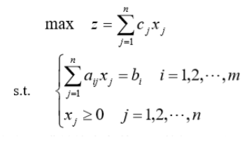

# 线性规划

参考资料：[CSDN—1](https://blog.csdn.net/qq_29831163/article/details/88893234)、[CSDN—2](https://blog.csdn.net/qq_29831163/article/details/88894966)、[CSDN—3](https://blog.csdn.net/qq_29831163/article/details/88896399)、[CSDN—4](https://blog.csdn.net/qq_29831163/article/details/89502094)、数学建模教材、运筹学教材。

---

##### 基本概念

​	线性规划问题研究的是在线性不等式或等式(可转化为两个线性不等式)的限制条件下，使某一线性目标取得最值的问题。

​	如何把实际问题转换为数学问题呢？关键就在于从实际问题中找到==目标函数==和问题中给出或隐含的==约束条件==，隐藏约束条件的寻找往往需要细心以及一定的经验。

​	==目标函数==：关于目标变量的函数。目标变量是指问题所求的变量，往往可以用一个或一组变量通过函数表达。

​	==决策变量==：参与目标函数运算的变量(不包括目标变量)。

​	==约束条件==：关于决策变量的不等式(或等式)。约束决策变量的范围，可以理解为决策变量的定义域。

​	找到上诉三个核心后，便可建立线性规划模型(若上述都为线性)，标准型(约束条件的符号可以取别的)如下：

​	建立好模型后，容易对目标函数进行求解。满足约束条件的所有解*x*都称为可行解，我们需要做的是找到使目标函数的值达到最值的可行解***x***，称其为==最优解==。通过matlab或lingo等方式进行求解很快的。

​	在求解后，我们还需要对解的性能进行分析。最有名的就是==灵敏度分析==，对于数学规划模型一定要做灵敏度分析。

​	灵敏度分析是指对系统因周围条件变化显示出来的敏感程度的分析，说人话就是检测略微改变决策变量的系数(上图的**c~j~**)时目标函数的值的波动程度，若波动大则称其对该决策变量敏感。具体方法在此不做展开，日后会补充。

---

##### 进阶知识

​	
