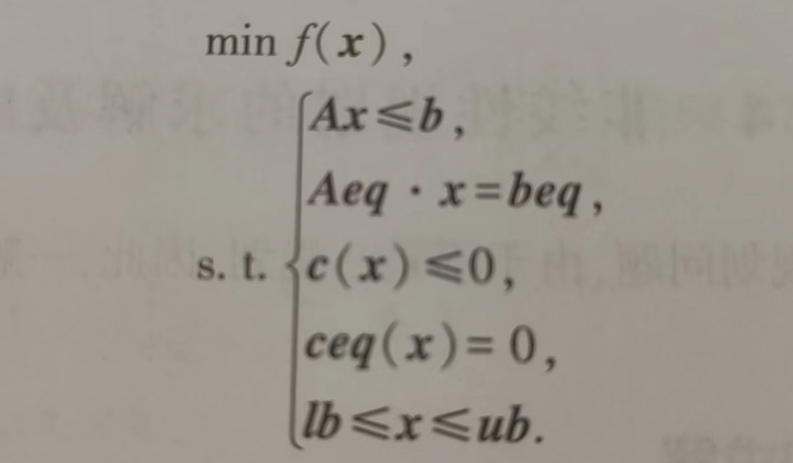

# 非线性规划

​	若目标函数或约束条件的表达式中至少有一个时非线性函数，则这种规划问题被称为非线性规划问题。解决非线性规划问题比线性规划问题困难许多，目前没有通用方法，各种方法都有各自的适用范围。而且一般非线性规划算法能给出的是局部最优解而不能保证是全局最优解。

---

​	求解有约束极值问题的方法主要包括将约束问题化为无约束问题、将非线性规划问题化为线性规划问题，以及将复杂问题变换为较简单问题的其他方法。

- 将约束问题化为无约束问题是一种常见的策略，通过引入拉格朗日乘数法或库恩-塔克条件等方法，将带有约束的极值问题转化为无约束的优化问题，从而简化求解过程。例如，拉格朗日乘数法适用于处理等式类型的约束条件，而库恩-塔克条件则适用于处理不等式类型的约束条件。这些方法帮助我们在有约束的条件下找到函数的极值。
- 将非线性规划问题化为线性规划问题也是一种有效的策略，通过近似或简化原问题，将其转换为一个或多个线性规划问题来求解。这种方法适用于那些可以近似为线性问题的非线性规划问题，从而利用线性规划的求解方法进行优化。
- 将复杂问题变换为较简单问题的其他方法包括但不限于变量替换、消元法等，通过变换问题的表述形式，使得原本复杂的极值问题变得更容易处理。这些方法通常需要根据具体问题的特点来选择和应用。

---

在Matlab工具箱中：

- 用于求解无约束极小值问题的函数有fminunc和fminsearch。

- 用于求解有约束极值问题的方法有两种。

  - 基于求解器的求解方法：

    先将非线性规划的数学模型写成标准形式：

    

    再通过以下命令进行计算：

    ~~~matlab
    [x,fval]=fmincon(fun,x0,A,b,Aeq,beq,lb,ub,nonlcon,options)
    ~~~

    其中，x的返回值是决策向量***x***的取值；fval返回的是目标函数的取值；fun是M函数或匿名函数定义的函数*f*(***x***)；x0是***x***的初始值；A，b，Aeq，beq定义了线性规划Ax ≤ b，Aeq · x = beq，若没有线性约束则都为[]；lb和ub是决策向量***x***的下界和上界，若不存在则都为[]；nonlcon是用M函数定义的非线性向量函数c(x),ceq(x)；options定义了优化参数，也可以使用默认参数设置。

  - 基于问题的求解方法

    没看懂。。。略
  
  另，无约束极值和有约束极值问题的手动计算在运筹学教材P165。

---